## ABSTRACT

This paper examines the relationship between partisan media bias and democratic backsliding by investigating two key mechanisms. First, I explore whether political leaders actively reduce media independence by creating biased narratives through their public communications. Second, I assess how media bias that distorts reality affects democracy backsliding. Using evidence from U.S. crime reporting, presidential social media interventions, and cross-national data, I argue that partisan media bias enlarges the gap between actual and perceived performance, creating conditions that allow support for drastic changes and favor democratic backsliding. This study contributes to understanding how elite rhetoric shapes media coverage and how distorted information environments undermine democratic stability.

Keywords: democratic backsliding, elite rhetoric, media bias, populism, crime coverage

## MOTIVATION AND RESEARCH PROBLEM

Recent events in the United States have revealed a concerning pattern in the relationship between political leadership, media coverage, and public perception. President Trump has repeatedly called out democratic leaning cities for high crime rates and deployed the National Guard to combat crime in these areas. These interventions have been accompanied by extensive media coverage, particularly from partisan outlets, emphasizing crime problems in the said cities. Republican social media and right-wing legacy media have consistently amplified narratives about rising crime in urban, Democratic-controlled areas.

However, a major discrepancy emerges when examining actual crime data. According to the FBI Crime Data Explorer (Federal Bureau of Investigation 2025), the actual crime rates in many of these cities tell a substantially different story than the narrative promoted by political leaders and echoed in partisan media coverage. This gap between reality and media representation raises fundamental questions about media independence, the role of political elites in shaping information environments, and the consequences for democratic governance.

This research addresses this question: How do political leaders generate biased narratives to enable democratic backsliding?

::: {#fig-1 layout-ncol=2}
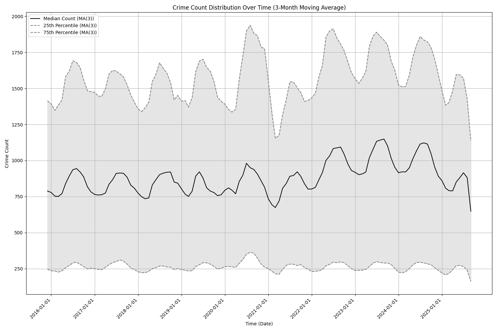

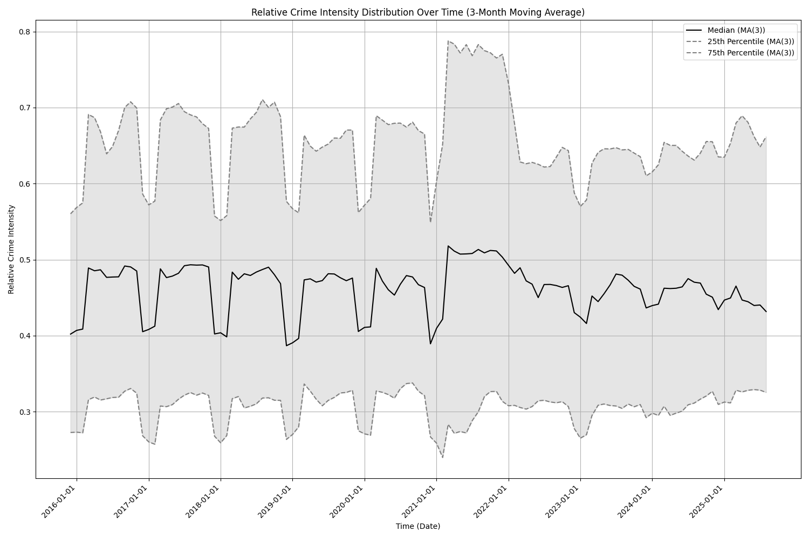

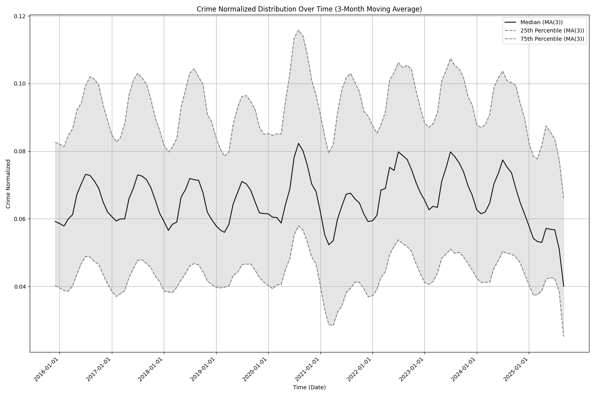

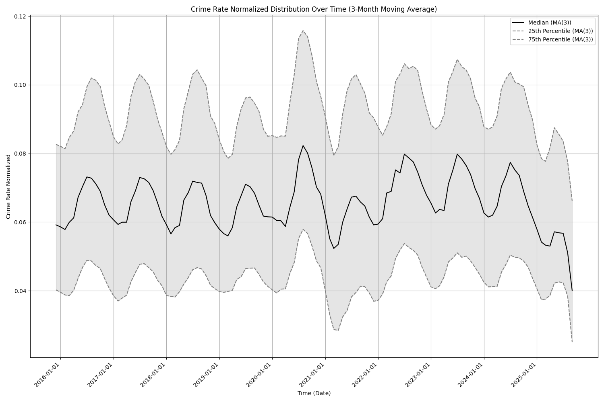

Crime trends across different metrics
:::


## LITERATURE REVIEW

The discrepancy between actual crime rates and media narratives reveals a fundamental gap in our understanding of democratic backsliding. While existing literature establishes that media bias exists and that better performance provides more stable regimes, evidence that poor actual performance causes democratic backsliding remains limited. This research is expected to address this gap by showing that it is not actual performance but perceived performance that matters. Partisan media bias enlarges the gap between perceived and actual performance, creating support for drastic changes that favor democratic backsliding. The research also intends to clarify the mechanism through which elite rhetoric shapes information environments, going beyond simple documentation of media bias to show how political leaders actively create and amplify distorted narratives that undermine democratic stability.

### Media Bias and Partisan Coverage

There is strong academic consensus that media bias exists in contemporary news coverage. Research has documented partisan bias in news media coverage of political leaders and events (Niven 1999; Niven 2001). Studies examine how partisan use and perceptions shape news consumption, with research analyzing patterns in cable news programming (Coe et al. 2008). The phenomenon of ideological selectivity in media use has been documented, showing evidence of how audiences engage with politically aligned media sources (Iyengar and Hahn 2009).

Research has also examined media bias in specific coverage domains. Studies analyze news media's relationship with stereotyping in crime news coverage, examining linguistic patterns in reporting (Gorham 2006). More recent research extends analysis to partisan differences in coverage of specific events, including mass shootings in the United States (Shah 2021). Additionally, scholarship examines how news media partisanship shapes coverage of policy issues and technologies, finding that partisan orientation influences framing and emphasis in reporting (Shaikh and Moran 2024).

While early research argued that objective news topics were not affected by partisan bias (Niven 1999; Niven 2001), subsequent work demonstrated that partisan selective exposure extends even to "soft" subjects such as crime (Iyengar and Hahn 2009). However, recent developments present a further evolution in this dynamic. Political elites now directly contest objective data through social media platforms, creating alternative narratives that contradict official statistics. Recent presidential communications about crime explicitly diverge from FBI data, with the White House claiming crime is "out of control" despite official statistics showing otherwise (The White House 2025). This represents a new phase: political leaders are not merely benefiting from existing media bias or selective exposure patterns, but may be actively generating competing factual claims about objective crime data that partisan media outlets follow suit.

### Democratic Backsliding and Performance

The evidence on how socioeconomic performance affects democratic stability is mixed. Better socioeconomic performance indeed provides more stable regimes (Carothers and Hartnett 2024). But evidence that lack of such performance causes democratic backsliding remains limited. In some cases, governance failures drove voters toward backsliding leaders. Brazil's Lava Jato corruption scandal alienated citizens from mainstream parties and turned them to Bolsonaro (Hunter and Power 2019). El Salvador's violent crime crisis led citizens to embrace Bukele (Economist 2019). It is worth noting that the perception of performance such as corruption also contributed to backsliding in India in 2014 and Mexico in 2018 (Sridharan 2014; Sánchez-Talanquer and Greene 2021). On the other hand, Achen and Bartels (2016) show that voters' perceptions of governmental performance may be only loosely tied to objective facts. Examining twelve cases across diverse regions, Carothers and Hartnett (2024) find that in eight of twelve cases inequality was trending downward before backsliding began; poverty levels decreased in nine of twelve cases, substantially in India and Poland; and in several cases—Bangladesh, India, the Philippines, Poland, and Turkey—growth was relatively high by regional and global standards. Governance failures such as corruption and crime played an important role in five cases—Brazil, India, Mexico, El Salvador, and the Philippines. Only three cases—Brazil, Hungary, and Tunisia—experienced major economic downturns before backsliding. While actual performance shows mixed results in causing backsliding, the perception of performance becomes a factor worth examining.


The literature on democratic backsliding has also established that backsliding leaders win elections when voters embrace promises of disruptive changes. In the pivotal elections that brought backsliding leaders to power, voters were embracing the promise of significant, even disruptive change in economic, social, or political domains (Carothers and Hartnett 2024). These voters were not throwing their support behind political figures who openly advocated ending democracy; many appeared to be trying to save democracy by giving it a reform-oriented reset (Carothers and Hartnett 2024). This suggests the potentiality that fabricating crises and exaggerating performance gaps can be a powerful tool for backsliding leaders to win elections by promising drastic changes.

## MAIN ARGUMENT

I argue that political leaders strategically generate biased narratives to shape media coverage. The resulting partisan media bias systematically distorts reality in coverage, reducing perceived performance relative to actual performance. This enlarges the gap between actual and perceived government performance, creating more support for disruptive changes and hence enabling democratic backsliding.

## HYPOTHESES

Building on this argument, I develop two hypotheses that test distinct but interconnected mechanisms through which political leaders undermine democratic stability. The first hypothesis examines the elite intervention mechanism, whether political leaders can actively shape information environments through strategic communications. The second hypothesis tests the downstream democratic consequences of distorted information environments.

*Hypothesis 1: Political leaders' strategic communications increase the gap between actual and perceived performance.*

This hypothesis captures the first mechanism: elite agency in creating biased narratives. If political leaders can successfully manipulate public perception through strategic communications that partisan media amplify, we should observe a widening gap between objective performance indicators and media coverage intensity following elite interventions. This represents a direct test of whether backsliding leaders actively construct the conditions for democratic erosion rather than merely exploiting existing grievances.

*Hypothesis 2: Media bias that distorts reality, creating more support for disruptive changes, enables democratic backsliding.*

The second hypothesis tests the ultimate democratic consequence of distorted information environments. Even if media bias exists independently of elite manipulation, systematic distortions that misrepresent actual performance should correlate with democratic backsliding across countries and over time. Together, these hypotheses establish both the mechanism through which political leaders generate biased narratives (H1) and the democratic consequences of such distortions (H2), providing a generalizable framework for understanding how information manipulation enables democratic backsliding in the United States and other countries.


## DATA SOURCES

This research utilizes multiple data sources and generates new variables. Crime rate data comes from the FBI Crime Data Explorer, which provides crime statistics across U.S. cities and states and allows tracking of temporal trends in various crime categories. 

Media coverage data will be collected through CNN and Fox News APIs, enabling systematic collection of news coverage about crime and allowing comparison between outlets with different partisan orientations.

The said two variables will then be used to generate the gap between actual and perceived performance.

Media bias measurement draws on the International News Media Bias Dataset, an extensive dataset available through HuggingFace that allows validation and extension of bias measures across different contexts. If that is not available, I will use the UnBIAS Classification Bert to classify the media articles into different bias levels.

Presidential communications will be automatically collected from Truth Social posts, enabling precise measurement of elite intervention timing and content. 

Finally, democratic quality data comes from V-Dem indices, which provide cross-national measures of democratic backsliding with multiple indicators of democratic quality and institutional performance across time.

## RESEARCH DESIGN

### Hypothesis 1 test: 

The first test examines whether political leaders increase media bias by creating biased narratives. The unit of analysis is state-time observations, allowing for systematic comparison across different contexts and periods. The dependent variable is the gap between actual and perceived performance, operationalized as the difference between actual crime rates from FBI data and the intensity of media coverage of crime in the same location and time period.

The key intervention here is President Trump's Truth Social posts about crime in specific regions, namely Illinois and District of Columbia, which serve as interventions that can be precisely timed and measured. The analysis will control for baseline crime rates, state voting records, and temporal and regional fixed effects. The expected outcome is that political leaders' strategic communications increase the gap between actual and perceived violent crimes, particularly when those narratives align with partisan media outlets' ideological orientation and when the state is controlled by the opposing party.

Given that the treatmentm, Trump's Truth Social posts about crime in specific regions, occurs at different times for Illinois and District of Columbia, this analysis employs the Callaway and Sant'Anna (2021) difference-in-differences estimator (csdid) rather than the traditional two-way fixed effects model. This methodological choice addresses the documented bias in conventional difference-in-differences estimators when treatment timing varies across units, ensuring more robust causal inference in this staggered adoption design.

### Hypothesis 2 test: 

The second test examines whether media bias that distorts reality increases the support for disruptive changes and enables democratic backsliding. The unit of analysis shifts to country-year observations, enabling cross-national comparison. 

The dependent variable is democratic backsliding, measured using V-Dem indices that capture various dimensions of democratic quality and erosion. The key independent variables include media bias measured using the UnBIAS Classification Bert on the media article in the researched countries. The analysis will control for actual economic performance, and regional and temporal fixed effects. The expected outcome is that democracy backsliding is more likely to occur in countries with media bias that distorts reality.

## METHODOLOGY

The first test will use a difference-in-differences design that specifies the dummy variables for the first treatment group and relative time from the intervention. This approach allows for causal inference of how the elite rhetoric intervention affects the outcome variable of two treated units that are treated at different times.

The second test will use a cross-national regression model that controls for regional and temporal fixed effects.

### Preliminary Results and Further Steps

::: {#fig-2 layout-ncol=2}
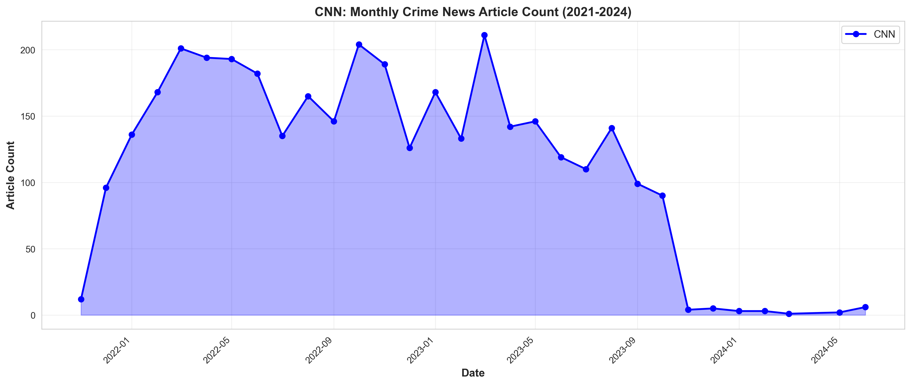

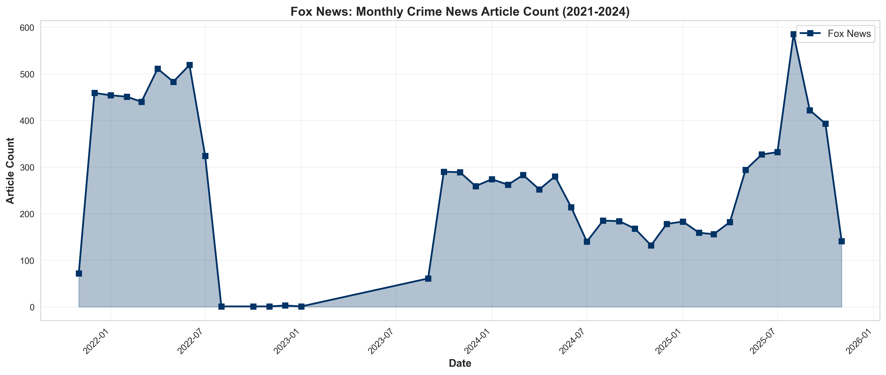

Frequency of Crime Reporting News Article Count from partisan outlets
:::

The preliminary evidence presented in Figure 2 reveals a notable divergence in crime coverage between partisan media outlets during the period of 2021-2025. While CNN's monthly crime news article count shows a relatively stable or declining trend in recent months, Fox News demonstrates a substantial surge in crime-related coverage during the same period. This divergent pattern is particularly pronounced following President Trump's social media interventions regarding crime in Democratic-controlled areas. The stark contrast between these two partisan outlets' coverage intensity, despite tracking the same underlying crime phenomena, provides initial support for the hypothesis that partisan media bias systematically distorts crime coverage. 

These preliminary findings suggest that the relationship between elite rhetoric, partisan media coverage, and the gap between actual and perceived crime rates merits rigorous empirical testing through the proposed Callaway and Sant'Anna (2021) difference-in-differences (csdid) design.

The next phase of this research will proceed through four key steps. First, I will classify the collected media articles into different bias levels using the UnBIAS Classification Bert or other state-of-the-art large language models. Second, I will quantify the gap between media coverage intensity and actual crime data to operationalize the bias of media coverage. Third, I will implement the Callaway and Sant'Anna (2021) difference-in-differences estimator to test Hypothesis 1, examining whether presidential social media interventions systematically increase the gap between actual and perceived crime rates in the United States. Finally, I will conduct cross-national regression analysis to test Hypothesis 2, assessing whether media bias that distorts reality correlates with democratic backsliding across countries.

## REFERENCES

Achen, Christopher H., and Larry M. Bartels. 2016. Democracy for Realists: Why Elections Do Not Produce Responsive Government. Princeton: Princeton University Press.

Callaway, Brantly, and Pedro H.C. Sant'Anna. 2021. "Difference-in-Differences with Multiple Time Periods." Journal of Econometrics 225(2): 200-230.

Carothers, Thomas, and Brendan Hartnett. 2024. "Misunderstanding Democratic Backsliding." Journal of Democracy. https://www.journalofdemocracy.org/articles/misunderstanding-democratic-backsliding/ (October 16, 2025).

Coe, Kevin, David Tewksbury, Bradley J. Bond, Kristin L. Drogos, Robert W. Porter, Ashley Yahn, and Yuanyuan Zhang. 2008. "Hostile News: Partisan Use and Perceptions of Cable News Programming." Journal of Communication 58(2): 201–19.

Economist. 2019. "El Salvador's New President Takes on the Country's Gangs." The Economist, June 6.

Executive Orders. 2025. "Declaring a Crime Emergency in the District of Columbia." The White House. https://www.whitehouse.gov/presidential-actions/2025/08/declaring-a-crime-emergency-in-the-district-of-columbia/ (October 16, 2025).

Federal Bureau of Investigation. "Crime Data Explorer (CDE)." Crime Data Explorer (CDE). https://cde.ucr.cjis.gov/LATEST/webapp/#/pages/explorer/crime/crime-trend (October 16, 2025).

Gorham, Bradley W. 2006. "News Media's Relationship with Stereotyping: The Linguistic Intergroup Bias in Response to Crime News." Journal of Communication 56(2): 289–308.

Hunter, Wendy, and Timothy J. Power. 2019. "Bolsonaro and Brazil's Illiberal Backlash." Journal of Democracy 30(1): 68–82.

Iyengar, Shanto, and Kyu S. Hahn. 2009. "Red Media, Blue Media: Evidence of Ideological Selectivity in Media Use." Journal of Communication 59(1): 19-39.

Niven, David. 1999. "Partisan Bias in the Media? A New Test." Social Science Quarterly 80(4): 847-57.

Niven, David. 2001. "Bias in the News: Partisanship and Negativity in Media Coverage of Presidents George Bush and Bill Clinton." Harvard International Journal of Press/Politics 6(3): 31–46.

Raza, Shaina. 2023. "Navigating News Narratives: A Media Bias Analysis Dataset." newsmediabias/news-bias-full-data · Datasets at Hugging Face. https://huggingface.co/datasets/newsmediabias/news-bias-full-data (October 16, 2025).

Sánchez-Talanquer, Mariano, and Kenneth F. Greene. 2021. "Is This Latin America's Populist Wave?" Journal of Democracy 32(4): 5-20.

Shah, V. 2021. "Death Across the News Spectrum: A Time Series Analysis of Partisan Coverage Following Mass Shootings in the United States Between 2012 and 2014." https://www.semanticscholar.org/paper/Death-Across-the-News-Spectrum%3A-A-Time-Series-of-in-Shah/bc337321059c0a265547708c0a8293552f3ffc58 (October 16, 2025).

Shaikh, Sonia Jawaid, and Rachel E. Moran. 2024. "Recognize the Bias? News Media Partisanship Shapes the Coverage of Facial Recognition Technology in the United States." New Media & Society 26(5): 2829–50.

Sridharan, E. 2014. "India's Watershed Vote: Hindu Nationalism in Power?" Journal of Democracy 25(4): 34-45.

The White House. 2025. "FACT: Yes, D.C. Crime Is Out of Control." The White House. https://www.whitehouse.gov/articles/2025/08/fact-yes-d-c-crime-is-out-of-control/ (October 16, 2025).

The White House [@WhiteHouse]. 2025. "'At Least 54 People Were Shot in Chicago over the Weekend, 8 People Were Killed... Pritzker Needs Help Badly, He Just Doesn't Know It yet. I Will Solve the Crime Problem Fast, Just like I Did in DC. Chicago Will Be Safe Again, & Soon. MAKE AMERICA GREAT AGAIN!' - President Trump." Twitter. https://x.com/WhiteHouse/status/1962868301987455067 (October 16, 2025).

"UnBIAS-Classification-Bert." 2024. newsmediabias/UnBIAS-classification-bert · Hugging Face. https://huggingface.co/newsmediabias/UnBIAS-classification-bert (October 16, 2025).

# UPDATED RESULTS AND ANALYSIS (From Presentation)

## Data Generation

**News Reports Processing:**

- Scraped news reports from CNN and Fox News APIs.
- Used LLM (llama3.1:8b-instruct-q4_K_M) to classify filter,and annotate the news reports, created a regional crimenews reports dataset.

**Architecture Design:**

```{mermaid}
%%| fig-width: 22
%%| fig-height: 6
flowchart TB
    A1[News Source 1]
    A2[News Source 2]
    A3[News Source 3]
    A4[...]
    A5[News Source N]
    
    B[Aggregate Raw Reports]
    
    C[Full News Report Dataset<br/>2021-2025]
    
    subgraph D["LLM Pipeline"]
        direction LR
        E1[Model 1: Relevance Classification]
        E2[Model 2: Location Annotation]
        E1 --> E2
    end
    
    F[Post-Processing]
    
    G[Regional Crime News Dataset<br/>with State-Level Annotations]
    
    A1 & A2 & A3 & A4 & A5 --> B
    B --> C
    C --> D
    D --> F
    F --> G
    
    style D fill:#e1f5ff
    style G fill:#e8f5e9
```

**Prompts Example:**

**Model 1 - Relevance Classification:**
```python
response_relevance = ollama.chat(
    model=model_name,
    messages=[{
        'role': 'user',
        'content': f'Is this text about crime in a US location? 
                    Respond in JSON format: 
                    {{"relevance": true}} or {{"relevance": false}}
                    
                    Text: {text}'
    }],
    format='json'
)
```

**Model 2 - Location Annotation:**
```python
response_location = ollama.chat(
    model=model_name,
    messages=[{
        'role': 'user',
        'content': f'Identify the exact US STATE mentioned in this text. 
                    If no state is mentioned, respond with "None". 
                    If the region is subnational, respond with the 
                    two digit state code. 
                    Respond in JSON format: 
                    {{"location": "two digit state code"}}
                    
                    Text: {text}'
    }],
    format='json'
)
```

## Methodology

**Doubly-Robust Difference-in-Differences (DRDID):**

$$
ATT_{DR} = \mathbb{E}\left[\left(\frac{G}{\mathbb{E}[G]} - \frac{\frac{p(X)(1-G)}{1-p(X)}}{\mathbb{E}\left[\frac{p(X)(1-G)}{1-p(X)}\right]}\right)(Y_1 - Y_0 - m(0,X))\right]
$$

where $G$ = treatment indicator, $p(X)$ = propensity score, $m(0,X)$ = outcome model

**Propensity Score Formula:**
$$
p(X) = P(G=1|X) = \frac{\exp(\gamma_0 + \gamma X)}{1 + \exp(\gamma_0 + \gamma X)}
$$

**Outcome Model (Improved Estimator):**
$$
m(0,t,X) = \mathbb{E}[\Delta Y_{it} | D=0, X_i] = \alpha_0 + \beta X
$$
where $\Delta Y_{it} = Y_{it} - Y_{i,t-1}$ (change in outcome from pre to post)

**Variables:**

- Outcome ($Y$): News frequency (monthly article count)
- Treatment ($G$): Indicator for DC (treated 2025/08) or IL (treated 2025/09)
- Time periods: 2 periods, pre-treatment and post-treatment
- Covariates ($X$): Crime rate (in covariate-adjusted model)

**Callaway & Sant'Anna Difference-in-Differences (CSDID):**

$$
ATT(g,t) = \mathbb{E}[Y_t - Y_{g-1} | G_g = 1] - \mathbb{E}[Y_t - Y_{g-1} | C = 1]
$$

$$
ATT_{dynamic}(e) = \sum_{g} \frac{P(G=g)}{\sum_{g} P(G=g)} \cdot ATT(g, g+e)
$$

where $ATT(g,t)$ = average treatment effect for group first treated at time $g$ in period $t$, $e$ = event time, $C$ = never-treated control group, $P(G=g)$ = proportion of units in treatment group $g$

**Variables:**

- Outcome ($Y$): Valid News frequency at region-time (monthly article count)  
- Treatment groups ($g$): $g=202508$ (DC), $g=202509$ (IL)
- Control group ($C$): Never-treated states (49 states)
- Time periods ($t$): 2025/01-2025/10
- Covariates ($X$): Crime rate per 100,000 population (in covariate-adjusted model)
- ATT(g,t) Estimation method: drdid
- Aggregation: Dynamic event study ($e \in [-12, 10]$)

## Results

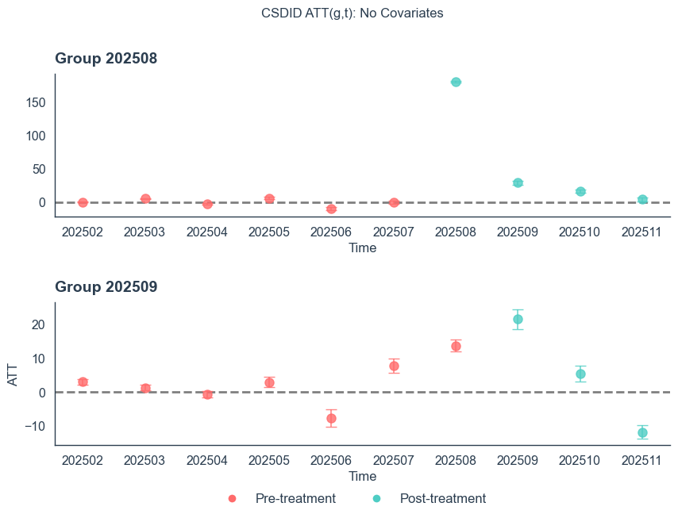
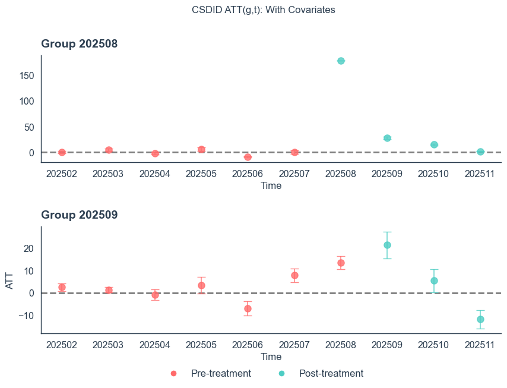

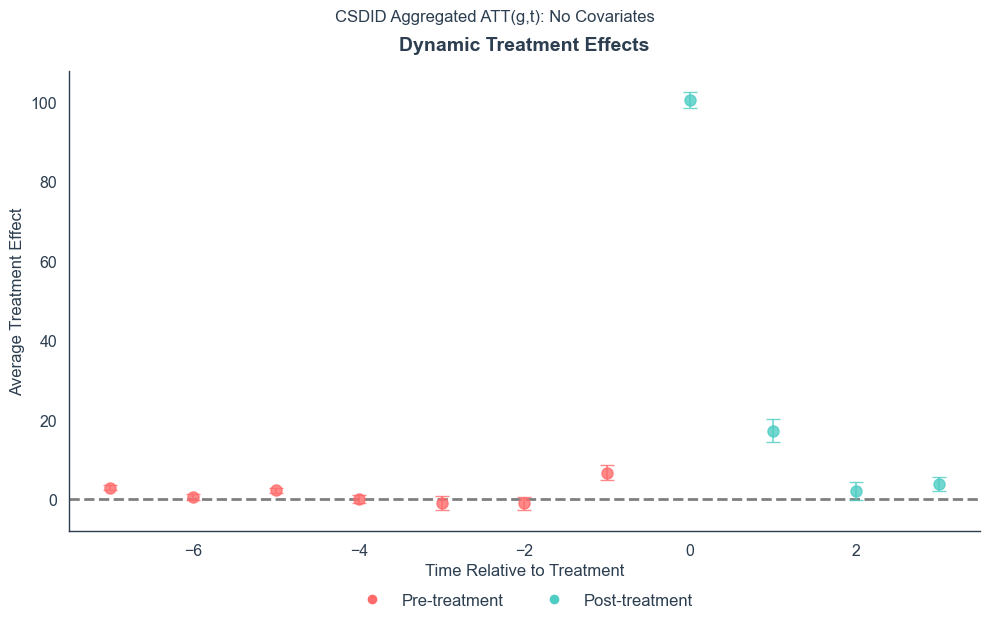


## Robustness Check

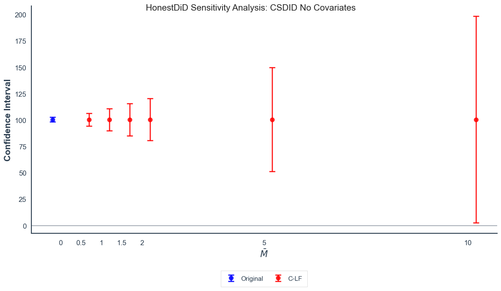
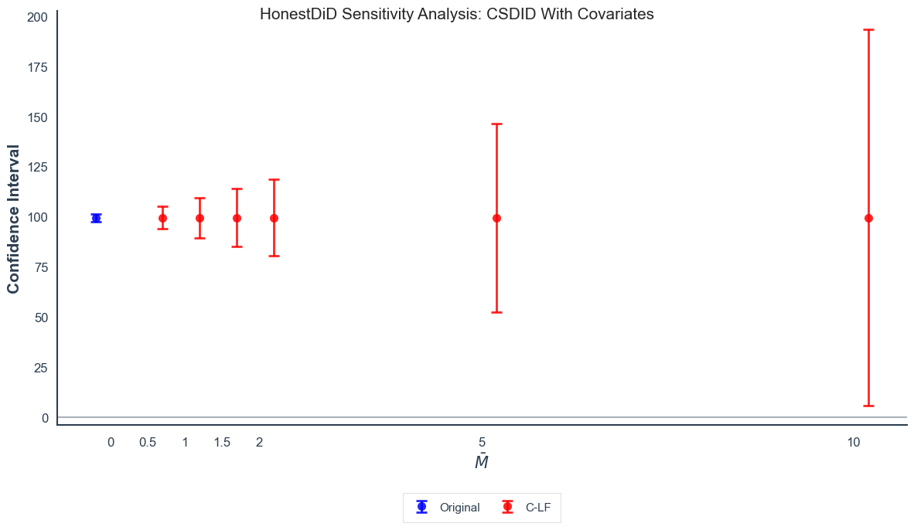

## Conclusion

- Presidential rhetoric significantly increased regional crime news coverage from aligned partisan media outlets: 

DC (2025/08) and IL (2025/09) experienced 100+ additional monthly articles post-intervention

- HonestDiD sensitivity analysis confirms results remain robust to violations of parallel trends assumption up to twice the baseline magnitude. 

## Limitations

- Data collection is limited to CNN and Fox News, and the news reports are not comprehensive.
- The CNN news are not completely collected, due to the limited funding available.
- Treated states are too few, only 2 states, DC and IL, making csdid results less reliable.

## Future Research

- Collect more news reports from more media outlets, and more states.
- Use more LLM pipelines to classify the support for the president's rhetoric
- Use fine-tuned models to get the bias level of the news reports.
- add pre treatment parallel trends assumption test. (event study)
  - there is one e=-1 has significant effect, indicates maybe there is some reverse causality: trump utilized existing media bias and increased it.
- investigage reverse causality:
media bias -> political leaders' messaging

democratic backsliding -> media bias and political leaders' messaging
